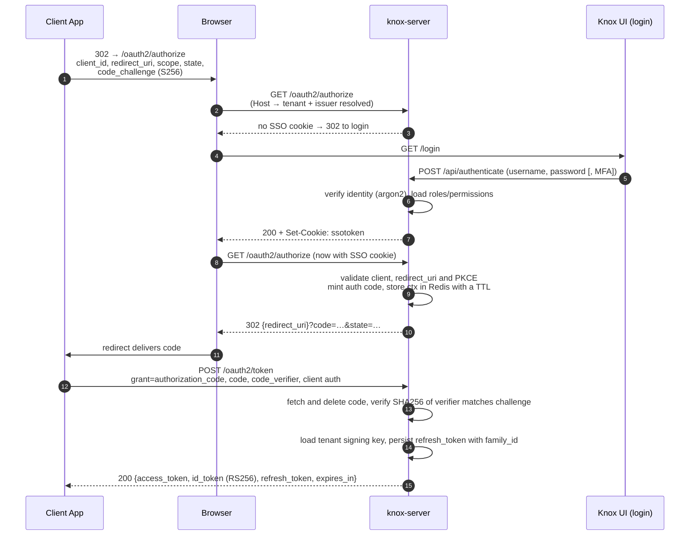

# Knox Platform — API Reference

**Base URL:** `https://{tenant}.{KNOX_BASE_DOMAIN}` — e.g. `https://acme.knox.example.com`.
Locally: `http://acme.lvh.me:3000` through the UI's dev proxy, or `http://acme.lvh.me:8080`
straight at the server.

**Tenant scoping:** the tenant comes from the **`Host` header**, not from the path. The
subdomain is stripped against `KNOX_BASE_DOMAIN` and resolved to a tenant before the
handler runs, so every path below is tenant-agnostic. A request with an unknown or
missing subdomain is rejected before it reaches a handler.

> Older revisions of this document described a `/{tenant_id}/…` path-prefixed scheme.
> That scheme is gone — the paths below are what
> [`server/src/main.rs`](../server/src/main.rs) actually serves.

**Authentication:** Bearer token via `Authorization: Bearer <access_token>` unless
otherwise noted.

**Route map:**

| Prefix | Surface |
|--------|---------|
| `/.well-known/*`, `/oauth2/*` | OIDC. Must stay at the root — the issuer is `https://{tenant}.{base}` with no path, so discovery has to resolve directly beneath it. CORS-open, no credentials. |
| `/api/*` | Management API. Same-origin only. |

---

## Table of Contents

1. [Authentication](#1-authentication)
2. [OAuth2 / OIDC](#2-oauth2--oidc)
3. [Identity Management](#3-identity-management)
4. [Roles](#4-roles)
5. [Client Management](#5-client-management)
6. [Pools](#6-pools)
7. [Tenant Management](#7-tenant-management)
8. [System](#8-system)
9. [Scope Reference](#9-scope-reference)
10. [Error Responses](#10-error-responses)

---

## 1. Authentication

### POST `/api/authenticate`

Authenticates a user with username and password. Returns an SSO token used to initiate the OAuth2 authorization flow.

**Auth required:** No  
**Content-Type:** `application/json`

**Request Body:**
```json
{
  "client_id": "management",
  "username": "user@example.com",
  "password": "MyPassword123!"
}
```

**Response `200 OK`:**
```json
{
  "sso": "YPIO7ddOAf3lWlYtSTUBquUWpZZoVYji"
}
```
> An `ssotoken` HTTP-only cookie is also set on the response. Whether the token is returned in the body is controlled by the tenant's `should_return_cookie_in_body` configuration.

**MFA Response `200 OK`** *(when the account has a verified MFA method):*
```json
{
  "mfa_token": "...",
  "user_id": "9bade55d-1193-4712-a5cd-7c402aedad9d",
  "methods": ["totp", "backup_code"]
}
```
> The `mfa_token` is a short-lived, single-use JWT (lifetime controlled by the tenant's `mfa_token_lifetime_seconds`, default 300s). Complete the login via `POST /api/authenticate/mfa`.

**Error Responses:**

| Status | Reason |
|--------|--------|
| `401 Unauthorized` | Invalid credentials, unknown client, or non-active account/client |
| `429 Too Many Requests` | Per-account, per-tenant, or per-IP failed-login limit reached |
| `400 Bad Request` | Missing or malformed fields |

Failed-login counters use a tenant-configurable fixed window. Defaults are 10
attempts per account, 1000 across a tenant, and 100 per source IP in 300 seconds.
Unknown, passwordless, and non-active identities follow the same Argon2 and
`401` path as an incorrect password.

---

### POST `/api/authenticate/mfa`

Completes an MFA login: exchanges an `mfa_token` (from the password step) plus a verification code for an SSO session.

**Auth required:** No (the `mfa_token` is the credential)  
**Content-Type:** `application/json`

**Request Body:**
```json
{
  "mfa_token": "...",
  "method": "totp",
  "code": "123456"
}
```
`method` is one of the `methods` returned by the password step: `totp` or `backup_code` (`webauthn` and `sms` are reserved). Backup codes are case-insensitive and may include dashes.

**Response `200 OK`:** same shape as the password login (`sso` body field + SSO cookie).

**Error Responses:**

| Status | Reason |
|--------|--------|
| `401 Unauthorized` | Invalid/expired/already-used `mfa_token`, or wrong code |
| `429 Too Many Requests` | Attempt limit exceeded for this `mfa_token` (tenant `mfa_max_verification_attempts`, default 5) |

Each `mfa_token` is single-use: after one successful verification it is invalidated. Each TOTP code is accepted at most once (replay protection), with ±1 time-step of clock drift tolerated.

---

### Password reset — `/api/authenticate/password/*`

Unauthenticated endpoints for resetting a forgotten password. A reset link is a bearer credential for the account, so redeeming one **still demands the account's second factor** when it has one — a leaked link cannot bypass MFA. See also the admin-issued link at [`POST /api/identity/{id}/password/reset`](#post-apiidentityidentity_idpasswordreset).

#### POST `/api/authenticate/password/forgot`

Requests a reset link for a handle. Body `{ "username": "...", "client_id": "..." }` — `client_id` names the pool the handle is looked up in, exactly as login does.

**Always answers `200 {}`**, whether or not the handle exists, so it cannot be used to enumerate accounts. Throttled per pool+handle. Gated behind the tenant's `self_service_password_reset` config (**off by default**): with no mailer wired up it has nowhere to deliver the link, so until then it returns `404` and the admin-issued path is the way to reset a password.

#### POST `/api/authenticate/password/reset`

Redeems a reset link. Body `{ "token": "...", "new_password": "..." }`.

- No second factor enrolled → the password is set. **Response `200`:** `{ "mfa_required": false }`.
- Second factor enrolled → the password is **not** changed; the reset token is consumed and a challenge is returned. **Response `200`:** `{ "mfa_required": true, "mfa_token": "...", "methods": ["totp", "backup_code"] }`. Complete it below.

`401 Unauthorized` for an invalid, expired, or already-used token.

#### POST `/api/authenticate/password/reset/mfa`

Second factor for a reset. Body `{ "mfa_token": "...", "method": "totp", "code": "...", "new_password": "..." }` — the new password is resubmitted here, so nothing password-shaped is stored between the two steps. The `mfa_token` carries the `knox:pwd_reset_mfa` scope and cannot be used at `/api/authenticate/mfa` (nor a login token here). **Response `200`:** `{}`.

Every completed reset revokes the identity's existing sessions and refresh tokens.

---

### MFA Enrollment — `/api/mfa/*`

Self-service management of the caller's own MFA methods. All routes require a Bearer access token with the `IdentityUpdate` scope (granted by the default `IdentitySelf` role) and operate on the identity in the token's `sub`.

| Method | Path | Description |
|--------|------|-------------|
| `POST` | `/api/mfa/totp/enroll` | Start TOTP enrollment. Returns `{ method_id, secret, otpauth_uri }` — render `otpauth_uri` as a QR code; the secret is shown once. Restarting an unconfirmed enrollment replaces it; a verified one returns `409`. |
| `POST` | `/api/mfa/totp/confirm` | Body `{ "code": "123456" }`. Verifies the first authenticator code, activates the method, and returns `{ backup_codes: [...] }` (10 single-use codes, shown once). |
| `GET` | `/api/mfa/methods` | Lists enrolled methods (id, method, verified_at, last_used_at, created_at). |
| `DELETE` | `/api/mfa/methods/{method_id}` | Removes a method. When the last verified method is removed, remaining backup codes are deleted too. |
| `POST` | `/api/mfa/backup-codes/regenerate` | Replaces all backup codes; returns the new set. Requires at least one verified method. |

TOTP parameters: SHA-1, 6 digits, 30-second step (RFC 6238 / authenticator app defaults). The issuer shown in authenticator apps is the tenant's `totp_issuer` config, falling back to the tenant slug. Secrets are encrypted at rest (AES-256-GCM); backup codes are stored hashed.

---

### GET `/api/audit/events`

Tenant-scoped audit event log: logins, MFA activity, token grants, refresh-token theft detection, and management changes (identities, clients, pools, MFA methods). Events are also emitted into the OTel pipeline (`knox::audit` log records) so platform operators see them in the observability stack; this API serves the tenant's own view.

**Auth required:** Bearer token with the `AuditRead` scope (granted by the `AuditViewer` and `TenantAdmin` roles)

**Query parameters** (all optional):

| Param | Description |
|-------|-------------|
| `from` / `to` | RFC 3339 bounds on `occurred_at` (inclusive) |
| `event_type` | Exact match, e.g. `auth.login` |
| `actor_id` | UUID of the acting identity/client |
| `outcome` | `success` \| `failure` \| `denied` |
| `limit` | Page size, default 50, max 200 |
| `cursor` | Opaque cursor from a previous response's `next_cursor` |

**Response `200 OK`** — newest first, keyset-paginated:
```json
{
  "items": [
    {
      "id": "…",
      "tenant_id": "…",
      "occurred_at": "2026-07-10T19:36:48Z",
      "event_type": "auth.login",
      "actor_type": "identity",
      "actor_id": "…",
      "target_type": null,
      "target_id": null,
      "outcome": "failure",
      "ip": "203.0.113.7",
      "user_agent": "…",
      "correlation_id": "d15a99d6f551cef6def908a159a0d9d6",
      "details": {"username": "user@example.com"}
    }
  ],
  "next_cursor": "MjAyNi0wNy0…"
}
```
> `correlation_id` is the OTel trace id of the request that produced the event (the same value returned in the `x-correlation-id` response header), so an audit row can be cross-referenced with the full trace in the observability dashboard.

**Event types:** `auth.login`, `auth.mfa_challenge`, `auth.mfa_verify`, `auth.mfa_lockout`, `mfa.enroll_started`, `mfa.enrolled`, `mfa.removed`, `mfa.reset`, `mfa.backup_codes_regenerated`, `token.issued`, `token.refresh_reuse_detected`, `identity.created|updated|deleted|password_changed|password_reset_requested`, `client.created|updated|deleted`, `role.assigned|revoked`, `pool.created`, `tenant.created|deleted`, `authz.cross_tenant_denied`. New types may appear over time; treat the field as an open set.

**Retention:** events are pruned daily after `audit_configuration.retention_days` (tenant config, default 90).

---

## 2. OAuth2 / OIDC

### Authorization Code + PKCE flow

The full flow, end to end. Every request carries the tenant's subdomain as its `Host`,
which is what selects the tenant and the issuer.



The other two grants (`refresh_token`, `client_credentials`) hit `/oauth2/token` directly
with no browser leg.

---

### POST `/oauth2/token`

Token endpoint supporting three grant types. Client credentials can be supplied as a `Basic` Authorization header (`base64(client_id:client_secret)`) or as form body fields.

**Auth required:** Client credentials (Basic header or form body)  
**Content-Type:** `application/x-www-form-urlencoded`

---

#### Grant: `client_credentials`

For machine-to-machine access. Requires a confidential client.

**Request:**
```
grant_type=client_credentials
scope=IdentityRead IdentityCreate
```
*Header:* `Authorization: Basic base64(client_id:client_secret)`

**Response `200 OK`:**
```json
{
  "access_token": "eyJ0eXAiOiJKV1Qi...",
  "token_type": "Bearer",
  "expires_in": 3600,
  "scope": "IdentityRead IdentityCreate"
}
```

> Client-credentials tokens have no identity behind them and so get no RBAC narrowing —
> only the client's `allowed_scopes` apply. Platform scopes (see
> [Scope Reference](#9-scope-reference)) are therefore refused on this grant outside the
> platform tenant.

---

#### Grant: `authorization_code`

Exchanges a PKCE-protected authorization code for tokens.

**Request:**
```
grant_type=authorization_code
client_id=e146af53-288c-41f0-83a0-004a908d86ba
code=1NCEIFAwlch4uGbZA9XuzQFij9uj1HHj
redirect_uri=https://myapp.com/callback
code_verifier=dBjftJeZ4CVP-mB92K27uhbUJU1p1r_wW1gFWFOEjXk
scope=IdentityRead
```

**Response `200 OK`:**
```json
{
  "access_token": "eyJ0eXAiOiJKV1Qi...",
  "token_type": "Bearer",
  "expires_in": 3600,
  "refresh_token": "6rPGHsXkMGnliAQFMxAjuRLfs9ujaQCtbXERyYg6U0Z...",
  "scope": "IdentityRead"
}
```
> `refresh_token` is only present if the client has `allow_refresh_tokens: true`.

---

#### Grant: `refresh_token`

Rotates a refresh token. The consumed token is immediately revoked. If a revoked token is replayed, the entire token family is revoked.

**Request:**
```
grant_type=refresh_token
client_id=e146af53-288c-41f0-83a0-004a908d86ba
client_secret=50cdf876bbff3c184c5124b8bcf80a8f524a5c24c6e70f68732e11201ff81c55
refresh_token=6rPGHsXkMGnliAQFMxAjuRLfs9ujaQCtbXERyYg6U0Z...
```

**Response `200 OK`:**
```json
{
  "access_token": "eyJ0eXAiOiJKV1Qi...",
  "token_type": "Bearer",
  "expires_in": 3600,
  "refresh_token": "newRotatedTokenHere...",
  "scope": "IdentityRead"
}
```

**Token Endpoint Error Responses:**

| Status | Reason |
|--------|--------|
| `400 Bad Request` | Missing required fields or unsupported grant type |
| `401 Unauthorized` | Invalid client credentials or expired/revoked token |
| `403 Forbidden` | Client not permitted to use the requested grant type |

---

### GET `/oauth2/authorize`
### POST `/oauth2/authorize`

Initiates the Authorization Code + PKCE flow. Reads the SSO session from the `ssotoken` cookie. If no valid session is found, redirects to the tenant's hosted login page.

**Auth required:** SSO cookie (`ssotoken`)  
**Parameters:** Query string (GET) or form body (POST)

| Parameter | Required | Description |
|-----------|----------|-------------|
| `client_id` | ✅ | UUID of the OAuth2 client |
| `redirect_uri` | ✅ | Must match a registered redirect URI |
| `state` | ✅ | CSRF protection token (opaque, returned unchanged) |
| `code_challenge` | ✅ | Base64url(SHA-256(code_verifier)) |
| `code_challenge_method` | ✅ | Must be `S256` |
| `scope` | ✅ | Space-separated list of requested scopes |
| `nonce` | ❌ | Optional OIDC nonce |
| `max_age` | ❌ | Maximum authentication age in seconds |
| `acr_values` | ❌ | Space-separated ACR values |
| `response_mode` | ❌ | Only `query` supported (default) |

**Example Request:**
```
GET /oauth2/authorize
  ?client_id=e146af53-288c-41f0-83a0-004a908d86ba
  &redirect_uri=https%3A%2F%2Fmyapp.com%2Fcallback
  &state=randomcsrfstate123
  &code_challenge=E9Melhoa2OwvFrEMTJguCHaoeK1t8URWbuGJSstw-cM
  &code_challenge_method=S256
  &scope=IdentityRead
  &nonce=randomnonce456
Host: acme.knox.example.com
```

**Response `302 Found` (success):**
```
Location: https://myapp.com/callback?code=1NCEIFAwlch4uGbZA9XuzQFij9uj1HHj&state=randomcsrfstate123
```

**Response `302 Found` (no session / expired session):**
```
Location: /login?redirect_uri=...
```

**Response `302 Found` (invalid scope):**
```
Location: https://myapp.com/callback?error=invalid_scope&state=randomcsrfstate123
```

---

### GET `/.well-known/openid-configuration`

Per-tenant OIDC discovery document. `issuer` is the value stored on the tenant row — set
when the tenant was created and never re-derived, so changing `KNOX_BASE_DOMAIN` does not
re-identify existing tenants.

**Auth required:** No

---

### GET `/.well-known/jwks.json`

Returns the tenant's public JSON Web Key Set. Used by resource servers to verify access tokens.

**Auth required:** No  
**Content-Type:** `application/json`

**Response `200 OK`:**
```json
{
  "keys": [
    {
      "kty": "RSA",
      "use": "sig",
      "alg": "RS256",
      "kid": "k17769380-fa64c282",
      "n": "0vx7agoebGcQSuuPiLJXZpt...",
      "e": "AQAB"
    }
  ]
}
```

---

## 3. Identity Management

All identity endpoints are nested under `/api/identity`.

**Self-service note:** Non-admin users (those without `IdentityCreate` scope) can only read, update, or delete **their own** identity. Operations on other identities require elevated scope.

---

### POST `/api/identity`

Creates a new human identity.

**Auth required:** Yes  
**Required scope:** `IdentityCreate`  
**Content-Type:** `application/json`

**Request Body:**
```json
{
  "email": "user@example.com",
  "password": "SecurePassword123!",
  "first_name": "Jane",
  "last_name": "Doe"
}
```

| Field | Required | Description |
|-------|----------|-------------|
| `email` | ✅ | Must be a valid email address |
| `password` | ✅ | Minimum 8 characters |
| `first_name` | ❌ | |
| `last_name` | ❌ | |

**Response `201 Created`:**
```json
{
  "id": "1aeaad81-7401-48a8-aaf0-9c7dea545c90",
  "tenant_id": "9a604c76-c6d0-4236-bdb0-34510b8ccc9d",
  "pool_id": "0f0d8f5c-2d0e-4a0b-9f3a-1b2c3d4e5f60",
  "kind": "Human",
  "username": "user@example.com",
  "email": "user@example.com",
  "email_verified": false,
  "first_name": "Jane",
  "last_name": "Doe",
  "metadata": {},
  "custom_attributes": {},
  "status": "active",
  "created_at": "2026-04-25T10:00:00Z",
  "updated_at": "2026-04-25T10:00:00Z"
}
```
> `password_hash` is never returned in API responses.

---

### GET `/api/identity`

Lists identities in the tenant.

**Auth required:** Yes  
**Required scope:** `IdentityRead`

---

### GET `/api/identity/{identity_id}`

Fetches a single identity by ID.

**Auth required:** Yes  
**Required scope:** `IdentityRead`  
**Self-service:** Non-admins may only fetch their own identity.

**Response `200 OK`:** *(same shape as create response)*

---

### PATCH `/api/identity/{identity_id}`

Partially updates an identity.

**Auth required:** Yes  
**Required scope:** `IdentityUpdate`  
**Self-service:** Non-admins may only update their own identity.  
**Content-Type:** `application/json`

**Request Body** *(all fields optional):*
```json
{
  "email": "newemail@example.com",
  "username": "new_username",
  "first_name": "Janet",
  "last_name": "Smith",
  "status": "active",
  "metadata": {
    "department": "engineering"
  },
  "custom_attributes": {
    "employee_id": "EMP-001"
  }
}
```

**Response `200 OK`:** *(updated identity object)*

---

### DELETE `/api/identity/{identity_id}`

Deletes an identity permanently.

**Auth required:** Yes  
**Required scope:** `IdentityDelete`  
**Self-service:** Non-admins may only delete their own identity.

**Response `200 OK`:**
```json
{
  "message": "Identity deleted"
}
```

---

### POST `/api/identity/me/password`

Changes the caller's own password. Acts on the token `sub`, never a path id.

**Auth required:** Yes  
**Required scope:** `IdentityUpdate` (granted by the default `IdentitySelf` role)  
**Content-Type:** `application/json`

**Request Body:**
```json
{
  "current_password": "...",
  "new_password": "...",
  "mfa": { "method": "totp", "code": "123456" }
}
```
The current password is verified first, before any MFA code is consumed. When the account has a verified second factor and `mfa` is omitted, the server answers `200 { "mfa_required": true, "methods": [...] }` and **nothing changes** — resubmit with a code. On success it answers `200 { "mfa_required": false }` and **revokes every session, including the caller's own**, so the next management call will `401`; treat that as "signed out", not an error.

| Status | Reason |
|--------|--------|
| `401 Unauthorized` | Wrong current password, or wrong MFA code |
| `400 Bad Request` | New password shorter than 8 characters |
| `429 Too Many Requests` | MFA attempt limit exceeded |

---

### POST `/api/identity/{identity_id}/password/reset`

Issues a one-time reset **link** for another identity (admin action). The administrator receives the link and delivers it out of band; no password is ever exposed, and nothing changes until the link is [redeemed](#password-reset--apiauthenticatepassword). Redemption still demands the user's own second factor.

**Auth required:** Yes  
**Required scope:** `IdentityUpdate` (plus `IdentityCreate` to target another identity)  
**Query:** `pool_id` (optional) — the directory the identity lives in; defaults to the caller's own.

**Response `200 OK`:**
```json
{
  "reset_url": "https://acme.knox.example/reset-password?token=...",
  "expires_at": "2026-07-23T18:45:00Z"
}
```
The link's lifetime is the tenant's `password_reset_token_lifetime_seconds` (default 900s); its shape follows `password_reset_url_template` when set. Audited as `identity.password_reset_requested`.

---

### DELETE `/api/identity/{identity_id}/mfa`

Clears an identity's MFA enrolment — every second factor and its backup codes (admin break-glass for a user locked out of their authenticator). Deliberately separate from a password reset, so recovering an account never silently strips its second factor.

**Auth required:** Yes  
**Required scope:** `IdentityUpdate` (plus `IdentityCreate` to target another identity)  
**Query:** `pool_id` (optional) — as above.

**Response `200 OK`:** `{ "message": "MFA enrolment cleared" }`. Audited as `mfa.reset` with the administrator as actor (distinct from the self-service `mfa.removed`).

---

### Identity role assignment

| Method | Path | Scope | Description |
|--------|------|-------|-------------|
| `GET` | `/api/identity/{identity_id}/roles` | `IdentityRead` | Roles held by the identity. Reading another identity's roles additionally requires `IdentityCreate`. |
| `POST` | `/api/identity/{identity_id}/roles` | `IdentityUpdate` | Body `{ "role": "TenantAdmin" }`. Assigns a role. |
| `DELETE` | `/api/identity/{identity_id}/roles/{role}` | `IdentityUpdate` | Revokes a role by name. `IdentitySelf` cannot be revoked. |

A caller cannot grant a role carrying scopes it does not itself hold, and the same check
guards revocation — otherwise a lesser-privileged admin could strip authority from a
greater one. Both are enforced in `IdentityService`, not just at the route.

---

## 4. Roles

### GET `/api/roles`

Every role defined in the tenant, with its scopes, so an admin UI can offer a picker
rather than asking for role names to be typed from memory.

**Auth required:** Yes  
**Required scope:** `IdentityRead`

System roles seeded per tenant: `IdentitySelf`, `IdentityViewer`, `IdentityCreator`,
`IdentityAdmin`, `TenantReader`, `TenantAdmin`, `TenantCreator`, `ClientAdmin`,
`AuditViewer`, and — in the platform tenant only — `PlatformAdmin`.

---

## 5. Client Management

All client endpoints are nested under `/api/clients`. These manage OAuth2 clients registered within a tenant.

---

### POST `/api/clients`

Creates a new OAuth2 client.

**Auth required:** Yes  
**Required scope:** `ClientCreate`  
**Content-Type:** `application/json`

**Request Body:**
```json
{
  "name": "My Web App",
  "description": "Frontend application",
  "logo_uri": null,
  "client_type": "confidential",
  "token_endpoint_auth_method": "client_secret_basic",
  "allow_refresh_tokens": true,
  "grant_types": ["authorization_code", "refresh_token"],
  "response_types": ["code"],
  "redirect_uris": ["https://myapp.com/callback"],
  "post_logout_redirect_uris": ["https://myapp.com/logout"],
  "allowed_scopes": ["IdentityRead", "IdentityUpdate"],
  "access_token_ttl": 3600,
  "refresh_token_ttl": 86400,
  "id_token_ttl": 3600,
  "auth_code_ttl": 600
}
```

| Field | Required | Default | Description |
|-------|----------|---------|-------------|
| `name` | ✅ | | 3–100 characters |
| `client_type` | ✅ | | `"confidential"` or `"public"` |
| `grant_types` | ✅ | | e.g. `["client_credentials"]`, `["authorization_code", "refresh_token"]` |
| `allowed_scopes` | ✅ | | Scopes this client may request |
| `description` | ❌ | `null` | |
| `logo_uri` | ❌ | `null` | |
| `token_endpoint_auth_method` | ❌ | `"client_secret_basic"` | |
| `allow_refresh_tokens` | ❌ | `false` | |
| `response_types` | ❌ | `[]` | |
| `redirect_uris` | ❌ | `[]` | Must be `https://` or `http://localhost` |
| `post_logout_redirect_uris` | ❌ | `[]` | |
| `access_token_ttl` | ❌ | `3600` | Seconds |
| `refresh_token_ttl` | ❌ | `86400` | Seconds |
| `id_token_ttl` | ❌ | `3600` | Seconds |
| `auth_code_ttl` | ❌ | `600` | Seconds |

> `public` clients automatically have `require_pkce: true` enforced.  
> Redirect URIs must use `https://` except for `localhost` / `127.0.0.1`.

**Response `201 Created`:**
```json
{
  "client": {
    "id": "3f2a1b4c-...",
    "tenant_id": "9a604c76-...",
    "name": "My Web App",
    "description": "Frontend application",
    "client_type": "confidential",
    "token_endpoint_auth_method": "client_secret_basic",
    "allow_refresh_tokens": true,
    "grant_types": ["authorization_code", "refresh_token"],
    "response_types": ["code"],
    "redirect_uris": ["https://myapp.com/callback"],
    "post_logout_redirect_uris": ["https://myapp.com/logout"],
    "allowed_scopes": ["IdentityRead", "IdentityUpdate"],
    "require_pkce": false,
    "access_token_ttl": 3600,
    "refresh_token_ttl": 86400,
    "id_token_ttl": 3600,
    "auth_code_ttl": 600,
    "token_version": 1,
    "status": "active",
    "metadata": {},
    "custom_attributes": {},
    "created_at": "2026-04-25T10:00:00Z",
    "updated_at": "2026-04-25T10:00:00Z"
  },
  "client_secret": "50cdf876bbff3c184c5124b8bcf80a8f524a5c24c6e70f68732e11201ff81c55"
}
```
> ⚠️ `client_secret` is returned **once only** at creation time. Store it securely — it cannot be retrieved again. Rotate it if lost.  
> `client_secret` is `null` for `public` clients.

---

### GET `/api/clients`

Lists all clients for a tenant with pagination.

**Auth required:** Yes  
**Required scope:** `ClientRead`

**Query Parameters:**

| Parameter | Default | Description |
|-----------|---------|-------------|
| `page` | `1` | Page number |
| `page_size` | `20` | Results per page (max 100) |
| `status` | *all* | Filter by `active` or `inactive` |

**Response `200 OK`:**
```json
{
  "items": [ /* array of ClientView objects */ ],
  "total": 5,
  "page": 1,
  "page_size": 20
}
```

---

### GET `/api/clients/{client_id}`

Fetches a single client by ID.

**Auth required:** Yes  
**Required scope:** `ClientRead`

**Response `200 OK`:** *(ClientView object, no `client_secret`)*

---

### PATCH `/api/clients/{client_id}`

Updates mutable fields on a client. Grant types, client type, and TTLs are immutable after creation — use rotation endpoints instead.

**Auth required:** Yes  
**Required scope:** `ClientUpdate`  
**Content-Type:** `application/json`

**Request Body** *(all fields optional):*
```json
{
  "name": "Updated App Name",
  "description": "New description",
  "logo_uri": "https://cdn.example.com/logo.png",
  "redirect_uris": ["https://myapp.com/callback", "https://myapp.com/oauth/callback"],
  "post_logout_redirect_uris": ["https://myapp.com/logout"],
  "allowed_scopes": ["IdentityRead"],
  "status": "inactive"
}
```

**Response `200 OK`:** *(updated ClientView object)*

---

### DELETE `/api/clients/{client_id}`

Permanently deletes a client. All associated refresh tokens are also deleted via cascade.

**Auth required:** Yes  
**Required scope:** `ClientDelete`

**Response `200 OK`:**
```json
{
  "message": "Client deleted"
}
```

---

### POST `/api/clients/{client_id}/rotate-secret`

Generates a new client secret and immediately invalidates all existing access tokens (increments `token_version`). The old secret stops working immediately.

**Auth required:** Yes  
**Required scope:** `ClientUpdate`

> Only valid for `confidential` clients. Returns `400` for `public` clients.

**Response `200 OK`:**
```json
{
  "client": { /* updated ClientView */ },
  "client_secret": "new_plaintext_secret_shown_once"
}
```
> ⚠️ The new `client_secret` is shown **once only**. Store it immediately.

---

### POST `/api/clients/{client_id}/rotate-token-version`

Increments the client's `token_version`, immediately invalidating all currently-issued access tokens for this client without changing the client secret. Use for emergency token revocation without credential rotation.

**Auth required:** Yes  
**Required scope:** `ClientUpdate`

**Response `200 OK`:** *(updated ClientView with incremented `token_version`)*

---

## 6. Pools

A pool is the directory an identity lives in, and the thing a client authenticates
against. Every tenant is provisioned exactly one `staff` pool — the one the console binds
to — and may create any number of `customer` pools for its own applications' end users.
A pool's `kind` is immutable and there is no way to create a second staff pool.

| Method | Path | Scope | Description |
|--------|------|-------|-------------|
| `GET` | `/api/pools` | `TenantRead` | Lists the tenant's pools. |
| `GET` | `/api/pools/{pool_id}` | `TenantRead` | Fetches one pool. |
| `POST` | `/api/pools` | `TenantUpdate` | Creates a `customer` pool. Body `{ "slug": "…", "name": "…", "description": null }` — `slug` is DNS-label-shaped, unique within the tenant, and immutable. Returns `201`. |

> Creating a pool decides who can authenticate to the tenant's apps, so it is gated on
> `TenantUpdate` (tenant configuration) rather than an identity scope.

---

## 7. Tenant Management

Tenant endpoints are under `/api/tenant`. Creating and deleting tenants are
**platform-level** operations: they require `Platform*` scopes, which only identities in
the platform tenant (`knox-root`) can hold.

---

### POST `/api/tenant`

Creates a new tenant. Automatically provisions:
- A signing key pair (RS256), encrypted at rest with the AES master key
- A `staff` identity pool
- A `management` client with all admin scopes
- System roles (`IdentityAdmin`, `TenantAdmin`, `ClientAdmin`, etc.)
- Optionally: an admin user identity

If `management_redirect_uris` is provided, the management client is also configured for `authorization_code` + `refresh_token` grants (suitable for a web admin UI).

**Auth required:** Yes  
**Required scope:** `PlatformTenantCreate`  
**Content-Type:** `application/json`

**Request Body:**
```json
{
  "name": "acme-corp",
  "description": "Acme Corporation tenant",
  "management_redirect_uris": ["https://admin.acme.com/callback"],
  "admin_user": {
    "email": "admin@acme.com",
    "password": "StrongPassword123!",
    "first_name": "Admin",
    "last_name": "User"
  }
}
```

| Field | Required | Description |
|-------|----------|-------------|
| `name` | ✅ | 3–100 characters. `admin` and `knox` are reserved. Becomes the tenant slug, and therefore its subdomain. |
| `description` | ❌ | |
| `management_redirect_uris` | ❌ | If provided, enables `authorization_code` on the management client |
| `admin_user` | ❌ | If provided, creates an admin identity with all admin roles |
| `admin_user.email` | ✅ (if admin_user) | |
| `admin_user.password` | ✅ (if admin_user) | Minimum 8 characters |
| `admin_user.first_name` | ❌ | |
| `admin_user.last_name` | ❌ | |

**Response `201 Created`:**
```json
{
  "tenant": {
    "id": "9a604c76-c6d0-4236-bdb0-34510b8ccc9d",
    "name": "acme-corp",
    "slug": "acme-corp",
    "issuer": "https://acme-corp.knox.example.com",
    "description": "Acme Corporation tenant",
    "status": "active",
    "config": {
      "authentication_configuration": { "...": "..." },
      "authorization_configuration": { "...": "..." }
    },
    "created_at": "2026-04-25T10:00:00Z",
    "updated_at": "2026-04-25T10:00:00Z"
  },
  "admin_client_id": "e146af53-288c-41f0-83a0-004a908d86ba",
  "admin_client_secret": "50cdf876bbff3c184c5124b8bcf80a8f524a5c24c6e70f68732e11201ff81c55",
  "admin_identity": {
    "id": "1aeaad81-7401-48a8-aaf0-9c7dea545c90",
    "email": "admin@acme.com",
    "first_name": "Admin",
    "last_name": "User",
    "status": "active"
  }
}
```
> ⚠️ `admin_client_secret` is returned **once only**. Store it immediately.  
> `admin_identity` is `null` if no `admin_user` was provided.  
> The new tenant is reachable at `https://{slug}.{KNOX_BASE_DOMAIN}` immediately — no DNS record and no certificate, because the cluster serves a wildcard host and a wildcard certificate.

---

### GET `/api/tenant/{tenant_slug}`

Fetches a tenant by **slug** (not UUID).

**Auth required:** Yes  
**Required scope:** `TenantRead` for your own tenant; `PlatformTenantRead` to read any other tenant.

**Response `200 OK`:** *(Tenant object)*

---

### GET `/api/tenant` *(list)*

Lists the tenants the caller can see.

- With `PlatformTenantList`: every tenant on the deployment (paginated, currently capped at 100).
- Otherwise, with `TenantRead`: a one-element list containing the caller's own tenant.

This is deliberately not a `403` for ordinary callers — the console calls it on every
dashboard load, and "you can see one tenant" is a normal condition.

**Auth required:** Yes

---

### DELETE `/api/tenant/{tenant_slug}`

Deletes a tenant and cascades to all its identities, clients, pools, keys and audit rows.

**Auth required:** Yes  
**Required scope:** `PlatformTenantDelete`

> The platform tenant itself cannot be deleted (`403`) — it holds the only `PlatformAdmin`
> role and the only client that can create tenants.

**Response `200 OK`:**
```json
{
  "message": "Tenant 'acme-corp' deleted",
  "detail": "All identities, clients, pools and keys were removed."
}
```

---

## 8. System

### GET `/api/sys/health`

Health check. No authentication required.

**Response `200 OK`:**
```json
{
  "status": "ok",
  "version": "0.1.1",
  "git_sha": "fc45e13"
}
```

### GET `/api/sys/version`

Build metadata (package version, git SHA, build timestamp). No authentication required.

> **Kubernetes probes:** the liveness/readiness/startup probes in
> `k8s/base/server/deployment.yaml` must point at `/api/sys/health` — the server mounts
> the status routes under `/api/sys`, nothing is served at `/sys`.

---

## 9. Scope Reference

Scopes are space-separated strings requested during token issuance. Tokens are narrowed to
the intersection of the client's `allowed_scopes` and — for identity-bearing grants — the
scopes reachable from the caller's roles.

### Identity Scopes

| Scope | Description |
|-------|-------------|
| `IdentityCreate` | Create new identities. Also grants the ability to manage other users' identities. |
| `IdentityRead` | Read identity records and the tenant's role list. Without `IdentityCreate`, limited to own identity. |
| `IdentityUpdate` | Update identity records, manage own MFA, assign/revoke roles. Without `IdentityCreate`, limited to own identity. |
| `IdentityDelete` | Delete identity records. Without `IdentityCreate`, limited to own identity. |

### Tenant Scopes

| Scope | Description |
|-------|-------------|
| `TenantCreate` | Legacy tenant-creation scope. Treated as platform authority — see below. |
| `TenantRead` | Read **your own** tenant, and list its pools. |
| `TenantUpdate` | Update tenant configuration; create customer pools. |
| `TenantDelete` | Delete your own tenant's data (platform deletion uses `PlatformTenantDelete`). |

### Client Scopes

| Scope | Description |
|-------|-------------|
| `ClientCreate` | Register new OAuth2 clients within a tenant. |
| `ClientRead` | List and view OAuth2 clients. |
| `ClientUpdate` | Update client settings, rotate secrets, rotate token version. |
| `ClientDelete` | Delete OAuth2 clients. |

### Audit Scopes

| Scope | Description |
|-------|-------------|
| `AuditRead` | Read the tenant's own audit events. |

### Platform Scopes

These act **across** tenants and are held only by identities in the platform tenant
(`tenants.is_platform`). They are deliberately *not* a superset relationship with the
tenant scopes above: `TenantRead` means "read my own tenant", `PlatformTenantRead` means
"read any tenant". Keeping them distinct is what stops a tenant admin's ordinary
`TenantRead` from reaching across the platform.

| Family | Scopes |
|--------|--------|
| Tenants | `PlatformTenantCreate`, `PlatformTenantRead`, `PlatformTenantUpdate`, `PlatformTenantDelete`, `PlatformTenantList` |
| Identities | `PlatformIdentityCreate`, `PlatformIdentityRead`, `PlatformIdentityUpdate`, `PlatformIdentityDelete`, `PlatformIdentityList` |
| Clients | `PlatformClientCreate`, `PlatformClientRead`, `PlatformClientUpdate`, `PlatformClientDelete`, `PlatformClientList` |
| Roles | `PlatformRoleCreate`, `PlatformRoleRead`, `PlatformRoleUpdate`, `PlatformRoleDelete`, `PlatformRoleList` |
| Platform ops | `PlatformConfigRead`, `PlatformConfigWrite`, `PlatformMetricsRead`, `PlatformAuditRead` |

Any scope beginning with `Platform`, plus `TenantCreate`, is refused on the
`client_credentials` grant outside the platform tenant — that grant has no identity and so
no RBAC narrowing, and every tenant's management client is provisioned with wide
`allowed_scopes` so a single console build works against any tenant.

---

## 10. Error Responses

All errors follow a consistent JSON structure:

```json
{
  "error": "Brief error description",
  "trace_id": "abc123def456"
}
```

| Status | Meaning |
|--------|---------|
| `400 Bad Request` | Malformed request, missing required fields, or validation failure |
| `401 Unauthorized` | Missing or invalid Bearer token / client credentials |
| `403 Forbidden` | Token is valid but lacks the required scope, or self-service boundary violation |
| `404 Not Found` | Resource does not exist within the specified tenant |
| `409 Conflict` | Resource already exists (e.g. duplicate email) |
| `429 Too Many Requests` | Rate/attempt limit exceeded (MFA verification, ingress `limit-rps`) |
| `500 Internal Server Error` | Unexpected server error — check logs / trace ID |

> All error responses include a `trace_id` field that correlates to the OpenTelemetry trace for that request, making it straightforward to locate the full trace in your observability stack.
