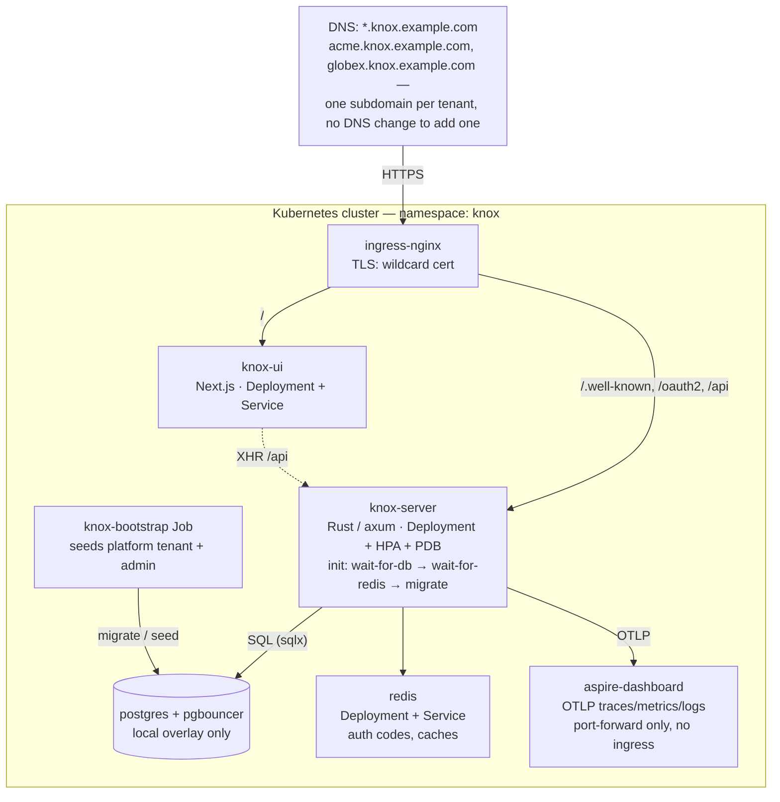

# Knox — Kubernetes manifests

Kustomize manifests for running Knox on a **local k3d cluster**. This is a hobby project;
these manifests exist so the multi-pod topology can be exercised on a laptop, not because
anyone should run Knox for real. See the [repository README](../README.md).

| Overlay | Target | Images |
|---------|--------|--------|
| `overlays/local/` | k3d, via `scripts/k3d-setup.sh` | built from this tree, side-loaded |
| `overlays/quickstart/` | k3d, via `scripts/k3d-setup.sh --published` | pulled from GHCR |

Both run Postgres and PgBouncer in-cluster — `quickstart` layers on `local` and changes
only where the images come from.

There is no cloud overlay in this repo. `base/` is written so an external managed database
*could* be dropped in (`DATABASE_URL` / `DATABASE_MIGRATE_URL` are plain secret keys, and
the `wait-for-db` init container is the only thing assuming an in-cluster Postgres), but
nothing here is set up, hardened, or tested for a real deployment.

---

## What `base/` contains



Routing is **host-based**: nginx matches one wildcard host, and the tenant is resolved
from the `Host` header inside the server. Creating a tenant is a database row — no DNS
record, no certificate, no ingress edit.

The path split lives in one Ingress (`knox-ingress`), not two — nginx rejects duplicate
host/path rules across Ingress objects, and with a wildcard host the server and UI would
overlap for certain.

> ⚠️ Kustomize silently skips a patch whose target matches no resource. Patching an
> Ingress by the old per-surface names (`knox-api-ingress`, `knox-ui-ingress`) therefore
> builds cleanly and does nothing at all. Patch `knox-ingress`.

---

## Running it (k3d)

Prerequisites: `brew install k3d kubectl kustomize`, and a Docker daemon.

```bash
./scripts/docker.sh build
```

```bash
./scripts/k3d-setup.sh setup
```

**In this mode the build step is not optional.** The cluster is fed from your local
Docker daemon: `docker.sh build` tags each image `latest` *and* `<git short SHA>`, and
`k3d-setup.sh` imports the SHA-tagged ones with `k3d image import` before pinning the
overlay to that same SHA. If an image is missing the script stops and tells you what to
build, rather than leaving you with an `ImagePullBackOff`.

To skip building entirely, use the published images instead:

```bash
./scripts/k3d-setup.sh --published setup
```

That applies `overlays/quickstart`, which points every Knox image at
`ghcr.io/lewks96/knox-iam-*:main` and sets `imagePullPolicy: Always` (the tag moves). The
rest of the flow is identical. `IMAGE_TAG=<short-sha>` pins a specific build;
`KNOX_IMAGE_SOURCE=published` is the environment equivalent of the flag.

`k3d-setup.sh setup` creates the cluster, installs nginx ingress, generates secrets
(database credentials, `AES_MASTER_KEY`, OTLP keys, dashboard token), issues a self-signed
wildcard certificate, deploys the local overlay, and fills in the ingress host, the TLS
block, and both ConfigMaps from the same base domain — so the cert SANs, the ingress rule,
and the app config cannot drift apart. It ends by running the bootstrap Job and printing
the admin credentials.

| Subcommand | Does |
|------------|------|
| `setup` | everything below, in order (alias: `all`; also the no-argument default) |
| `create` | the k3d cluster and the ingress controller |
| `deploy` | (re)apply the manifests — run after `docker.sh build` to pick up a rebuild |
| `bootstrap` | the one-shot Job seeding the root tenant, admin, and management client |
| `observe` | port-forward the Aspire dashboard to localhost:18888 |
| `tls` | regenerate the self-signed wildcard cert (auto-runs inside `deploy`) |
| `restart [svc]` | rollout-restart all knox deployments, or one |
| `delete` | tear the cluster down |

Environment worth knowing: `KNOX_IMAGE_SOURCE` (`local` | `published`), `IMAGE_TAG`,
`KNOX_BASE_DOMAIN` (default `lvh.me`; use `<ip-with-dashes>.sslip.io` when k3d runs on
another host), `KNOX_PUBLIC_PORT` (default `8443`), `CLUSTER_NAME`, `DOCKER_ORG`,
`AES_KEY`, `ADMIN_EMAIL` / `ADMIN_PASSWORD`.

`AES_KEY` is only generated when the cluster does not already hold one — the Postgres PVC
outlives a redeploy, and a fresh key would leave every tenant's signing key undecryptable.

Manual deployment, if you prefer — note this uses the committed `latest` tags rather than
pinning a SHA, and does not fill in the ingress host or the ConfigMaps:

```bash
kubectl apply -k k8s/overlays/local/
kubectl get pods -n knox -w
```

`scripts/seed-secrets.sh` re-seeds the dev secrets into an already-running namespace.

> Running `k3d-setup.sh deploy` leaves `overlays/local/kustomization.yaml` modified — it
> rewrites `newTag:` to the current SHA. That is expected; the committed value is `latest`.

---

## Verify a deployment

```bash
kubectl get pods -n knox

# Server logs
kubectl logs -n knox -l app=knox-server --tail=50 -f

# Migration logs (init container)
kubectl logs -n knox -l app=knox-server -c migrate

# Health — note the /api prefix; nothing is served at /sys
curl https://knox-root.<your-base-domain>/api/sys/health
```

Observability is the Aspire dashboard. It cannot be hosted at a sub-path
([dotnet/aspire#4159](https://github.com/dotnet/aspire/issues/4159)), so it has no ingress:

```bash
./scripts/k3d-setup.sh observe
```

which is a port-forward (`kubectl port-forward -n knox svc/aspire-dashboard 18888:18888`).
Then open <http://localhost:18888> with the `DASHBOARD_UI_TOKEN` the setup script printed.

---

## Configuration surface

| Object | Holds |
|--------|-------|
| ConfigMap `knox-app-config` | `KNOX_BASE_DOMAIN`, `KNOX_SCHEME`, pool sizing (`MAX_CONNECTIONS`, …), Argon2 cost, OTLP endpoint, log filter |
| ConfigMap `knox-ui-config` | `BASE_DOMAIN`, `MANAGEMENT_CLIENT_ID`, `MANAGEMENT_TENANT_ID` |
| Secret `knox-app-secret` | `DATABASE_URL`, `DATABASE_RO_URL`, `DATABASE_MIGRATE_URL`, `REDIS_URL`, `AES_MASTER_KEY` |
| Secret `knox-aspire-secret` | `OTLP_API_KEY`, `OTLP_AUTH_HEADER`, `DASHBOARD_UI_TOKEN` |
| Secret `knox-db-credentials` | Postgres superuser username/password — **only** consumed by the in-cluster Postgres in the local overlay |

`base/secrets.yaml` is a committed template with `REPLACE_ME` placeholders, and it is
deliberately **not** in `base/kustomization.yaml` — the scripts create these secrets
instead, so the placeholders can never be applied by accident.

`KNOX_TRUST_FORWARDED_HOST` must stay `false` in any cluster: nginx preserves the
original `Host`, and trusting `X-Forwarded-Host` would let a caller choose which tenant
they resolve as.

> ⚠️ **`AES_MASTER_KEY` wraps every tenant's RSA signing key.** Changing it after tenants
> exist orphans those keys — the existing ones would have to be re-wrapped first.

---

## Scaling

The HPA scales the server between 2–10 replicas on CPU (70%) in `base/`; the local
overlay pins a single replica. To override manually:

```bash
kubectl scale deployment knox-server -n knox --replicas=5
```

A PodDisruptionBudget and `maxUnavailable: 0` rolling updates keep the API up across node
drains and deploys.

---

## Notes

- **Images** are tagged `latest` in `base/`, pinned to a git SHA by the local overlay
  (from `scripts/docker.sh build`), and pointed at GHCR by the quickstart overlay (from
  `.github/workflows/publish-images.yml`).
- **Migrations** run from the `migrate` init container on every server pod, against
  `DATABASE_MIGRATE_URL` (a *direct* connection — sqlx uses advisory locks, which
  PgBouncer's transaction pooling breaks). Concurrent pods are safe: one applies, the
  rest no-op.
- **pg_cron** drives refresh-token pruning, registered by the
  `20260424140000_refresh_token_cron` migration. The database must have the extension
  available or that migration fails.
- **wait-for-db** in `base/` polls the in-cluster `knox-db-rw` service. Anything backed by
  an external database has to remove that init container (`op: remove` on
  `initContainers/0`).
